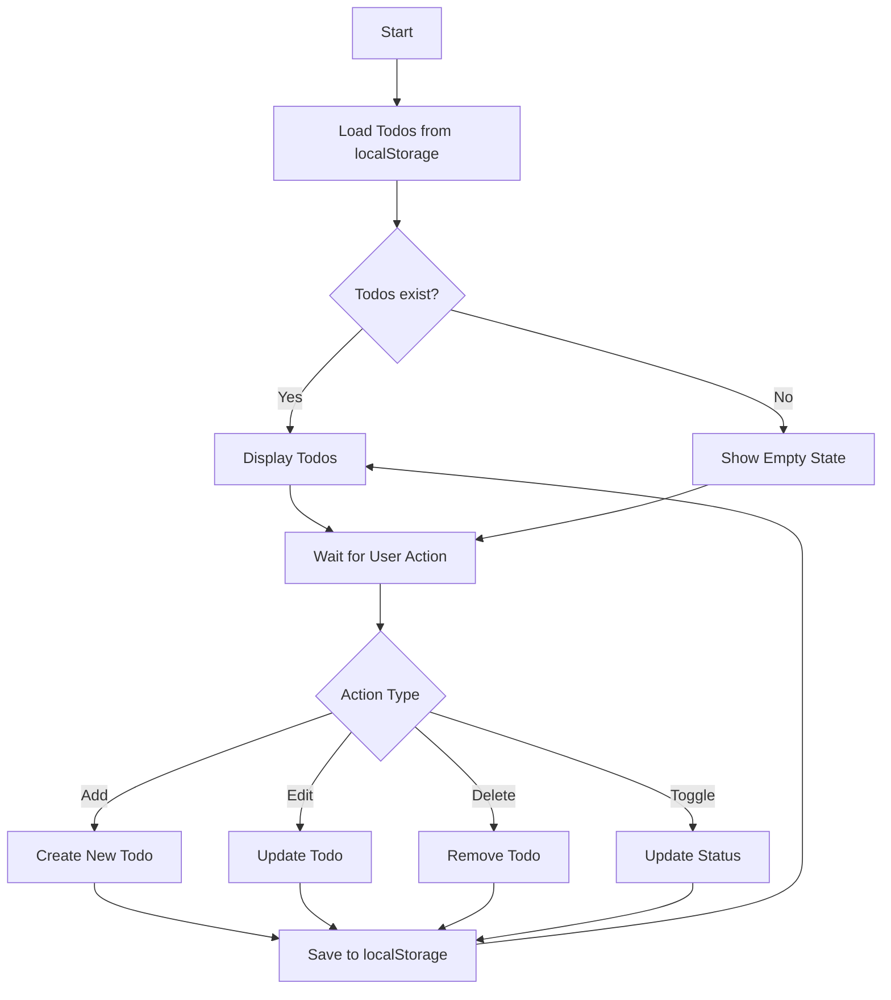
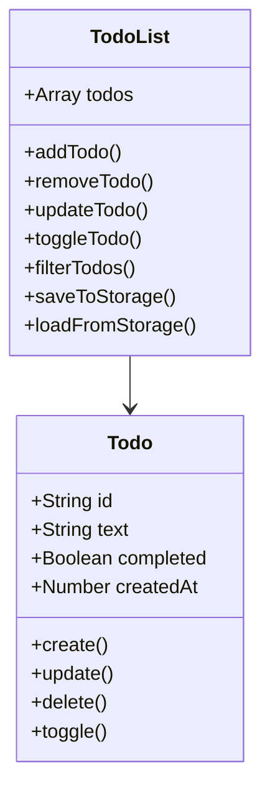

# Todo App Implementation Guide

A simple Todo app using vanilla JavaScript with localStorage for CRUD operations.

## Features

- Add new todos
- Mark todos as complete
- Edit existing todos
- Delete todos
- Persist todos in localStorage
- Filter todos (All/Active/Completed)

## Data Structure

```javascript
{
  id: string,         // Unique identifier
  text: string,       // Todo content
  completed: boolean, // Completion status
  createdAt: number  // Timestamp
}
```


## Flow Diagrams





## Best Practices

1. Use unique IDs for todos
2. Debounce localStorage saves
3. Handle empty states
4. Validate input data
5. Use event delegation
6. Implement error handling
7. Add loading states
