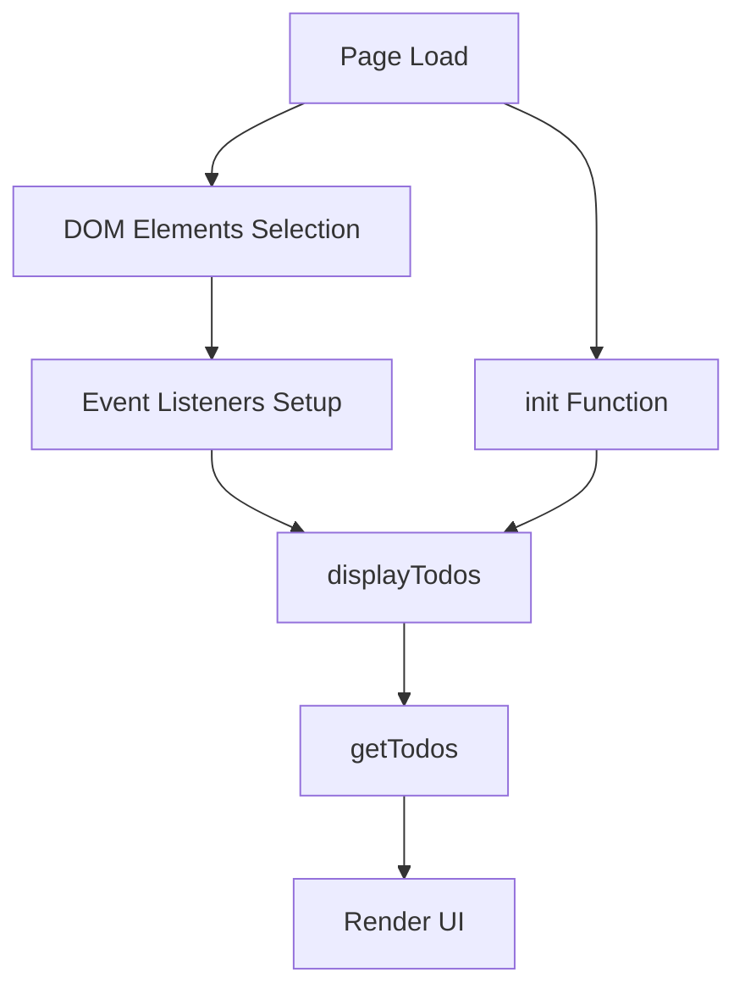
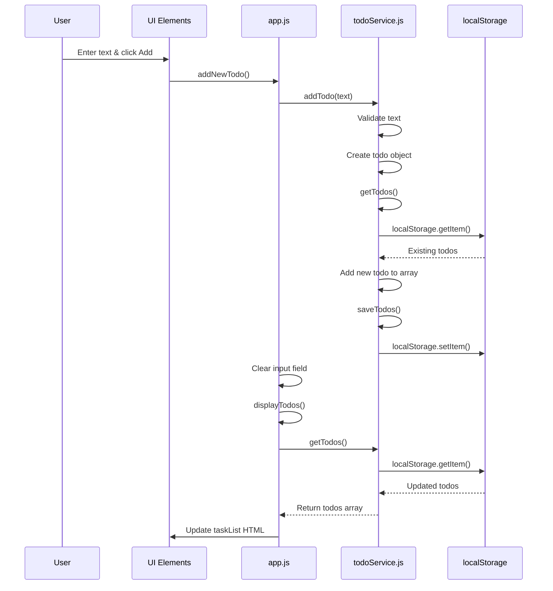
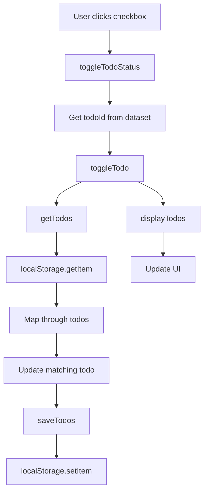
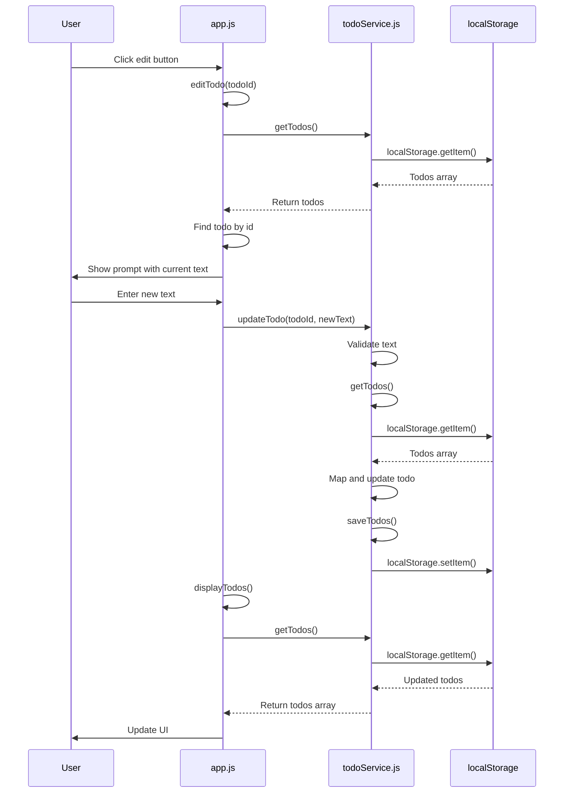
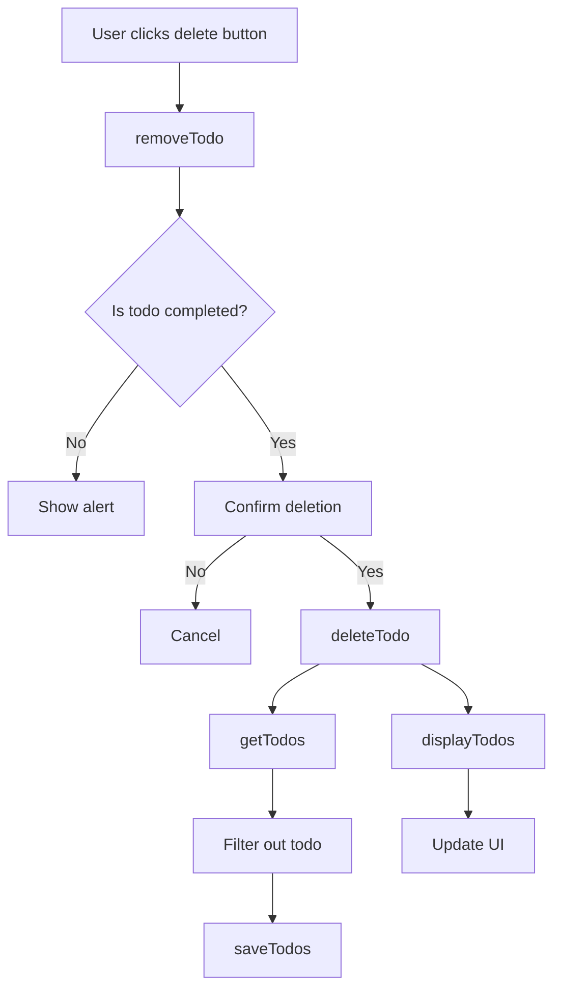
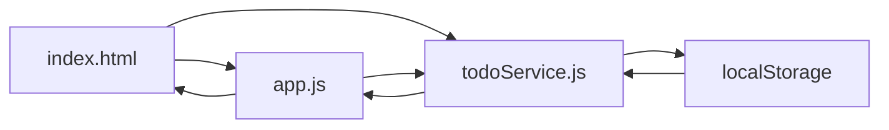
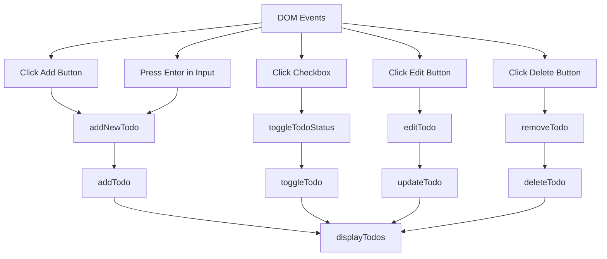
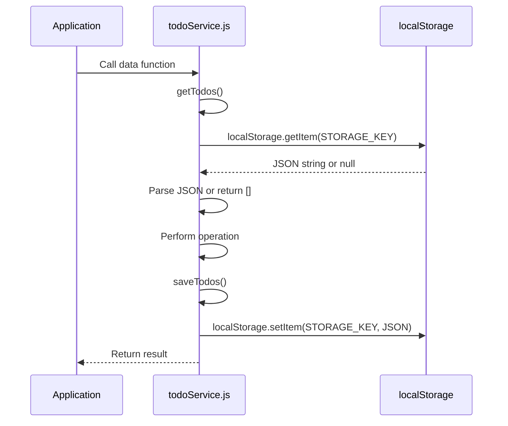
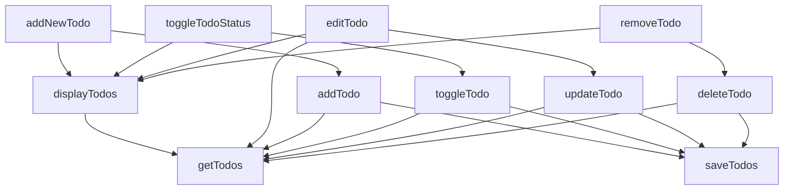
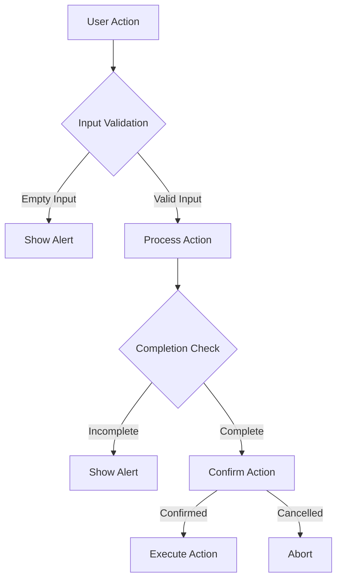

# Todo App Function Call Flow

This document visualizes the function call patterns in the Todo application using Mermaid diagrams.

## Application Initialization Flow

## Adding a Todo Flow

## Toggling Todo Status Flow

## Editing a Todo Flow

## Removing a Todo Flow

## Data Flow Between Files

## Event Handling Flow

## localStorage Interaction

## Function Dependencies

## Error Handling Flow

